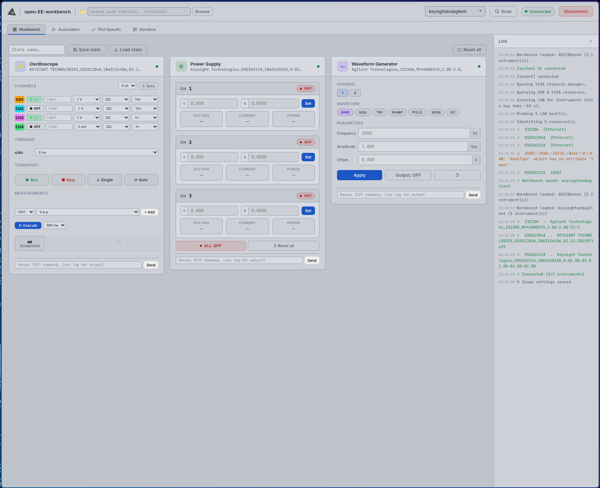

# Open-EE-workbench

A non-proprietary, cross-compatible VISA toolset for automating the modern electronic engineering workbench.
Works out of the box with any combination of supported instruments — no vendor lock-in.

Built on PyVISA and PyVISA-py with SCPI dialect coverage across **149 instrument families** spanning **19 instrument types** and **40+ vendors**: Keysight, Rigol, Rohde & Schwarz, Tektronix, Siglent, Agilent, Keithley, SRS, Lake Shore, Anritsu, and more.

> Forever a work in progress.

📖 **[Full documentation on the Wiki](https://github.com/kerstensrobin/open-EE-workbench/wiki)**

---

## Quick start

```bash
git clone https://github.com/kerstensrobin/open-EE-workbench
cd open-EE-workbench
python install.py             # install deps + optional desktop launcher
python core/nachoVisa.py      # scan bench, save workbench
./open-eew                    # launch GUI  (open-eew.bat on Windows)
```

On Linux, USB instruments need a one-time udev rule:
```bash
python core/nachoVisa.py --fix-udev   # then re-plug USB instruments
```

**[Note for Windows users]** If no USB instruments are found and you don't already have a vendor VISA implementation installed, there might be some driver tweaks needed. See the **[Wiki](https://github.com/kerstensrobin/open-EE-workbench/wiki/Windows-USB-Setup)** for the full walkthrough.

---

## What's inside

| | |
|---|---|
| **Workbench** | Instrument cards with live controls for scope, PSU, AWG, DMM, and electronic load. Save / load / reset instrument state snapshots. Unrecognised instruments can be manually assigned a family. |
| **Automation** | Parametric tests: DC sweep (single / simultaneous / nested), PSU interrupt transient, AC frequency sweep, DMM logger, waveform & harmonic analysis, battery capacity discharge (with live voltage/capacity chart). |
| **Plot Specific** | Purpose-built tests that produce specific, well-defined plots — the kind that appear in a component datasheet. Currently: IV Curve (Static Characteristic) and Transfer Characteristic for BJT / FET. |
| **Sandbox** | Build arbitrary test sequences with a no-code column-based pipeline editor. |
| **Python** | Full Python scripting console with syntax highlighting. Instruments, families, and helper functions are pre-injected into scope — no boilerplate needed. |
| **CLI scripts** | Standalone Python scripts for screenshots, sweeps, and waveform analysis. |



---

## Folder structure

```
open-EE-workbench/
├── app.py              Flask + SocketIO server, entry point
├── install.py          dependency installer (creates .venv)
├── open-eew            launch script (Linux / Mac)
├── open-eew.bat        launch script (Windows)
├── core/
│   ├── eewBackbone.json    SCPI command database (149 families, 40+ vendors)
│   ├── eewBackbone.py      classify() + get_command()
│   ├── helpers.py          shared VISA helpers used by all routes
│   ├── nachoVisa.py        instrument discovery CLI
│   ├── setWorkbench.py     drive instruments to a saved state
│   ├── demo.py             offline demo resources (no hardware needed)
│   └── routes/             Flask API blueprints (connection, instruments, …)
├── ui/                 single-file web front-end (index.html)
├── workbenches/        per-bench instrument config JSON files
├── scripts/            standalone Python scripts (sweeps, screenshots, …)
├── results/            test output — CSV data, scope captures, plots
└── screenshots/        GUI screenshots
```

---

## SCPI coverage

| Type | Families |
|---|---|
| Oscilloscope | 33 |
| Power supply | 28 |
| AWG / Function generator | 21 |
| Multimeter | 15 |
| Lock-in amplifier | 7 |
| Spectrum analyzer | 7 |
| SMU / Source meter | 6 |
| Electronic load | 5 |
| Temperature controller | 4 |
| RF signal generator | 4 |
| Vector network analyzer | 4 |
| LCR / Impedance meter | 3 |
| Laser source | 3 |
| Thermostream / environmental chamber | 2 |
| Gaussmeter | 2 |
| Vacuum gauge | 2 |
| Optical power meter | 1 |
| Frequency counter | 1 |
| Motion controller | 1 |

To add a new instrument, add an entry to `core/eewBackbone.json` — no code changes needed.
→ **[eewBackbone](https://github.com/kerstensrobin/open-EE-workbench/wiki/eewBackbone)**

---

## Wiki

| Page | |
|---|---|
| [eewBackbone](https://github.com/kerstensrobin/open-EE-workbench/wiki/eewBackbone) | SCPI database, adding instruments |
| [Workbench and Instruments](https://github.com/kerstensrobin/open-EE-workbench/wiki/Workbench-and-Instruments) | Workbench files, roles, instrument assignment |
| [CLI](https://github.com/kerstensrobin/open-EE-workbench/wiki/CLI) | nachoVisa.py, setWorkbench.py, standalone scripts |
| [GUI - Automation](https://github.com/kerstensrobin/open-EE-workbench/wiki/GUI---Automation) | Built-in parametric tests |
| [GUI - Plot Specific](https://github.com/kerstensrobin/open-EE-workbench/wiki/GUI---Plot-Specific) | Datasheet-style plots — IV Curve, Transfer Characteristic |
| [GUI - Sandbox](https://github.com/kerstensrobin/open-EE-workbench/wiki/GUI---Sandbox) | Custom test builder |
| [Python Scripting](https://github.com/kerstensrobin/open-EE-workbench/wiki/Python-Scripting) | Python console — available objects, examples |
| [About Testing](https://github.com/kerstensrobin/open-EE-workbench/wiki/About-Testing) | Engineering context for every test |

---

## Community

Discuss, report issues, or get involved in development on the **[EEVblog forum thread](https://www.eevblog.com/forum/projects/open-ee-workbench-a-cross-compatible-interface-for-your-equipment-489668/)**.

Made with love by [nacho.works](https://nacho.works)

---

## Acknowledgements

- **[Gert Lauritsen](https://github.com/gert-lauritsen)** — battery capacity test logic and Korad KEL103 SCPI command reference ([KE103](https://github.com/gert-lauritsen/KE103), MIT licence, used with permission); OWON XDM multimeter SCPI dialect ([OWON_SCPI_PY](https://github.com/gert-lauritsen/OWON_SCPI_PY), used with permission)
- **[PyVISA](https://pyvisa.readthedocs.io/)** (PyVISA team) — Python VISA instrument communication layer (MIT licence)
- **[pyvisa-py](https://pyvisa-py.readthedocs.io/)** (PyVISA team) — pure-Python VISA backend enabling USB/LAN instrument access without NI-VISA (MIT licence)
- **[CodeMirror](https://codemirror.net/)** (Marijn Haverbeke et al.) — code editor used in the Python Console tab (MIT licence)
- **[uPlot](https://github.com/leeoniya/uPlot)** (Leon Sorokin) — lightweight canvas charting library used for IV Curve, DMM Logger, and Battery Capacity plots (MIT licence)
- **[PyMeasure](https://github.com/pymeasure/pymeasure)** (PyMeasure contributors) — open-source scientific instrument library; SCPI command references for 70+ instrument families were derived from PyMeasure drivers and incorporated into eewBackbone.json (MIT licence)
